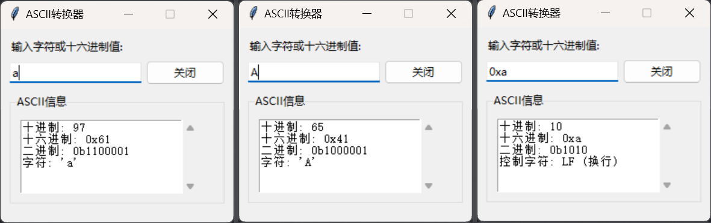

# ToolsbyAI
AI 写的小工具❤️

# ascii_converter.py

运行 python 脚本将启动一个置顶窗口，输入字符或十六进制值会有下拉菜单显示相关信息，没有内容时会自动隐藏 ASCII 信息框，仅保留输入框。主要是为了方便查找 ASCII 对应的十六进制

# qr_scanner.py

运行 python 脚本将启动一个置顶窗口，点击【截屏并扫描二维码】将捕获当前屏幕并解析存在的二维码，并下拉窗口显示结果，清除结果后将仅保留【截屏并扫描二维码】按钮大小的窗口。

由腾讯云代码助手 codebuddy 编写
